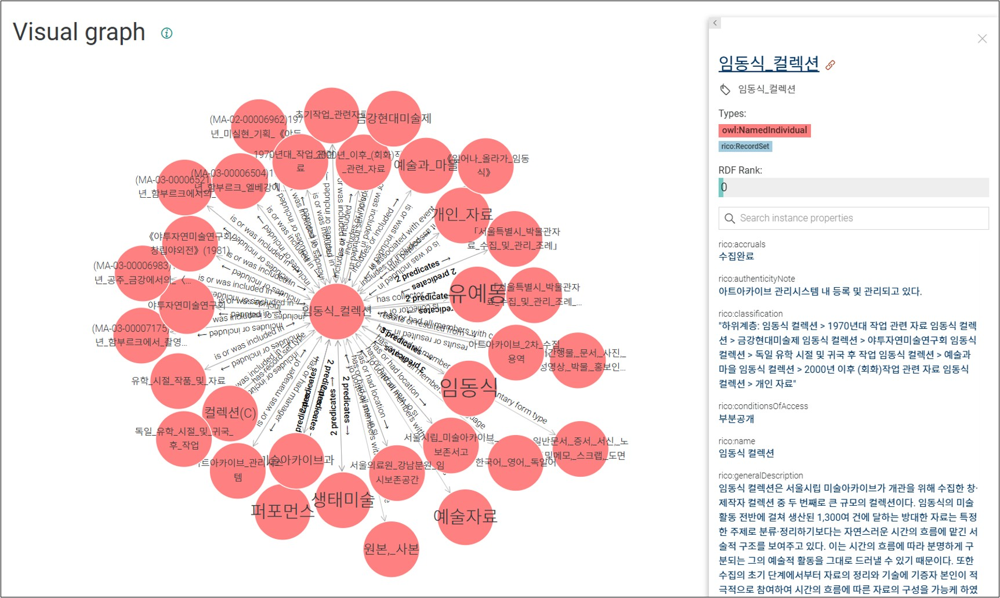
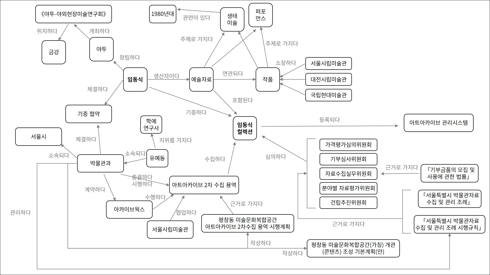
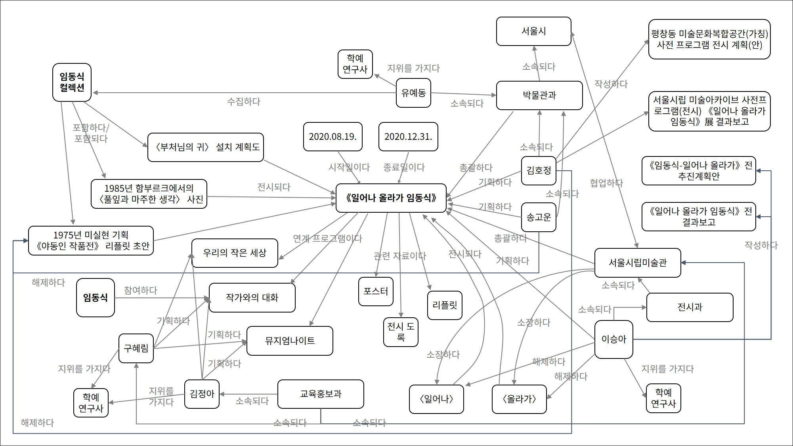
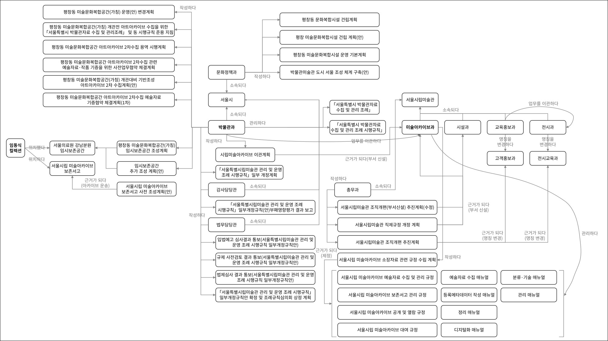
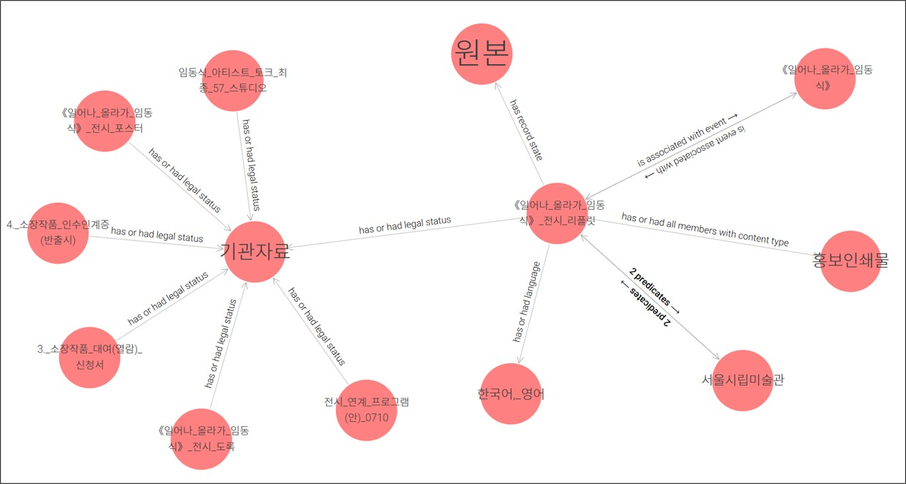
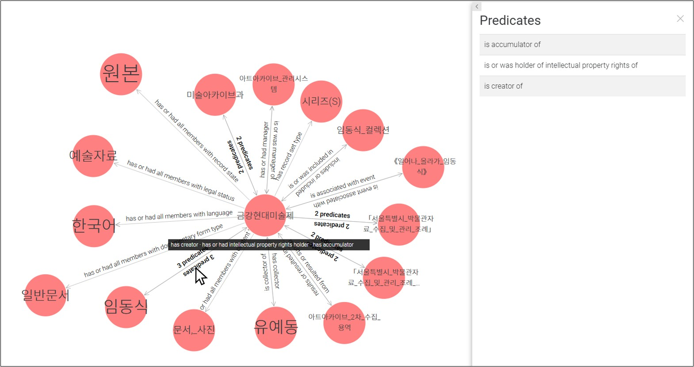

<h2 align="center">Collection Visualization Beta</h2>

**
🌐<a href="README.md">한국어로 보기</a>
**

### **1. Overview**

The Collection Visualization Beta of Art Archives, Seoul Museum of Art(SeMA AA) is an ontology graph visualizing its holdings using Records in Contexts (RiC). All concepts related to the collection are represented as circular nodes—key points of connection—with lines indicating the relationships between them. This includes not only collection items, authority records, and thesauri, but also previously unlinked concepts such as artworks, departments, and regulations. Through the Collection Visualization Beta, users can explore and grasp at a glance the context in which collection items were created, collected, and utilized.

### **2. Purpose and Pilot Collection of the Collection Visualization Beta**

○ Purpose of the Collection Visualization Beta

- Multidimensional Visualization of collections
- Since the collection visualization is built upon the top-level category of art archives—the collection—it currently only provides information that reflects the results of acquisition. However, by applying the multidimensional approach of Records in Contexts (RiC) to the collection, contextual information such as institution archives related to the acquisition process can also be incorporated into the collection's framework.

○ Pilot Collection of the Collection Visualization Beta

- The *Rim Dongsik Collection* was selected for its potential to illustrate diverse relationships during the preparatory phase of SeMA AA’s opening.
- Collections acquired, held, and managed by SeMA AA
- Collections related to artworks held in the collection of SeMA
- Collections that include artistic materials used in archive exhibitions
- Collections associated with authority records and thesauri maintained by SeMA AA
- Collections subject to the laws and regulations governing SeMA and SeMA AA
- Collections whose physical locations were changed due to the establishment of a (temporary) preservation storage facility
- Collections currently available via the Collection Visualization service

### **3. Development Process of the Collection Visualization Beta**

○ Creation of Workflow Diagram
- To provide a clear overview of the collection’s contextual relationships, we created a workflow diagram organized into three stages: acquisition, exhibition, and Institutional handover. The diagram includes elements such as artistic materials, institutional records (including approval documents), collection items, individuals, organizations, departments, exhibitions, and art-related terminology. This contextual information is connected with lines to illustrate the relationships between elements.

  
  

○ Mapping the Workflow Diagram to RiC-CM
- In this mapping, the contextual information in the workflow diagram was mapped to *entities* in RiC-CM; the values of this information were mapped to *attributes* of those entities; and the connecting lines between contextual elements were mapped to *relations* between entities. By applying RiC-CM, we were able to identify relationships that had not been captured during the original drafting of the diagram. As a result, we extracted 118 entities, 1,157 attributes, and 1,095 relations.

    ※ Entities and relations are organized hierarchically and become more specific at lower levels. Attributes reflect this hierarchical structure—attributes of higher-level entities are inherited by those at lower levels. To define the scope as precisely as possible, we used the most specific (lowest-level) entities and relations when mapping the data.

    ※ Some relationships in the diagram were difficult to represent clearly using only the predefined relations in RiC-CM. In such cases, we substituted the relation with the most similar or broadly applicable higher-level relation from RiC-CM.
- The mapped entities can be grouped into the following categories:

| Entity&nbsp;ID | Entity&nbsp;Name | Entity Type |
| --- | --- | --- |
| RiC-E01 | Thing | Preferred Terms in Thesauri, Artwork |
| RiC-E02 | Record&nbsp;Resource | - |
| RiC-E03 | Record&nbsp;Set | Collection, Series, File |
| RiC-E04 | Record | Art Records, Institutional Records(e.g., departmental approval documents, exhibition publications, documents related to Exhibition-related Programs, documents on artwork loans and returns) |
| RiC-E05 | Record&nbsp;Part | - |
| RiC-E06 | Instantiation | Attachments of Art Records(digitized outputs), Exhibition-prepared reproductions of Art Records |
| RiC-E07 | Agent | - |
| RiC-E08 | Person | Artist, Curator |
| RiC-E09 | Group | - |
| RiC-E10 | Family | - |
| RiC-E11 | Corporate&nbsp;Body | Group, Administrative Agency, SeMA, Department of the Seoul Metropolitan Government, Department of SeMA, Commissioned Vendor, Committee |
| RiC-E12 | Position | Position |
| RiC-E13 | Mechanism | System |
| RiC-E14 | Event | - |
| RiC-E15 | Activity | Exhibition, Agreement, Project, Exhibition-related program |
| RiC-E16 | Rule | Laws, Ordinances, SeMA AA Regulations, SeMA AA Manuals |
| RiC-E17 | Mandate | - |
| RiC-E18 | Date | Date, Exhibition start date, Exhibition end date |
| RiC-E22 | Place | Performance and exhibition venue, Archival Storage |

○ Conversion and Visualization of RiC-CM Mapped Data into RiC-O
- To visualize the RiC-CM mapped data as an ontology graph, it first needs to be converted into RiC-O in RDF format. This is because the ICA distributes a base RDF file that structures the components of RiC-O.
- Using the RiC-O annotation property ‘rico:RiCCMCorrespondingComponent’, wwe converted the entities, attributes, and relations from RiC-CM into the corresponding RiC-O classes and properties (datatype and object properties). The result was saved in RDF format using the ontology editor *Protégé*, and uploaded to the ontology visualization tool *GraphDB* to generate the ontology graph.

### 4. Exploring the Collection Visualization Beta

○ Applied Standards: RiC-CM (v1.0), RiC-O (v1.0.2)

○ Target Collection: Rim Dongsik Collection
- [Access the Rim Dongsik Collection Ontology Graph (Click)](http://121.131.4.200:7200/graphs-visualizations?saved=56d7f8cce17747e3bb841f2339af056a)

    ※ Login is required to ensure a consistent operating environment. (Username: admin / Password: root)

    ※ If the graph does not display immediately, go to the left-hand menu and select Explore > Visual graph, then choose Rim Dongsik Collection under Saved graphs.

○ Tool Used: Semantic graph database *GraphDB*

○ Navigation Instructions: Interact with the graph using mouse controls
- Click a node to view its detailed information.
- Double-click a node or click the expand button that appears on mouseover to reveal additional nodes connected by relations, expanding the graph.
- Click the focus button that appears on mouseover to re-center the graph around the selected node.
- Relationship lines between nodes are labeled with the corresponding relation. When multiple relations exist, they are summarized for readability; click the line to view all associated relations.

    ※ You can identify the subject and object of each relation based on the reading direction of the text (e.g., subject → object).
- Use the magnifying glass icon in the top-right corner to search for nodes.

  

### 5. Significance of the Collection Visualization Beta

○ Overcoming the Limitations of the Previous Collection Visualization

- The initial collection visualization was built based on an internal analysis of SeMA AA’s holdings. As a result, the nodes and relationships were limited to collections, items, authority records, and thesaurus preferred terms.
- However, by applying RiC, it became possible to comprehensively and precisely model not only the collections themselves, but also the surrounding contextual information—such as acquisition processes, exhibition usage, and institutional handover—without omissions.

○ Application of the Official Version of RiC
- As Korea’s first archive-based art museum, we applied RiC to archival data in the field of art.

○ Identifying the Limitations of Applying RiC
- To represent the traditional hierarchical structure (Collection–Series–File–Item) in a multidimensional format, it was necessary to define and refine contextual information—such as the circumstances under which records were created—as individual entities. When institutional records were insufficient, it became difficult to model related operational background information in depth.
- Understanding and implementing the diverse relationship structures in RiC (e.g., 1:N, N:1, N:N) in a detailed model can be time-consuming.
- In some cases, due to the limited availability of domain-specific relationships tailored to the visual arts, we had to substitute with the most similar or broadly applicable higher-level relationships.

    ※ However, one of the design principles of RiC-O, as stated by the ICA, is extensibility. RiC-O allows for the addition of new subclasses and subproperties beyond those provided by default, enabling ontology expansion as needed.

**Contact**

semaaa@seoul.go.kr

02-2124-7400
